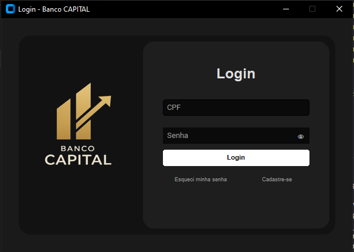
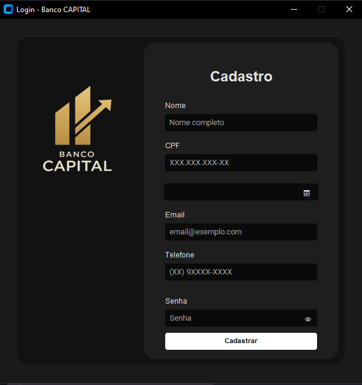
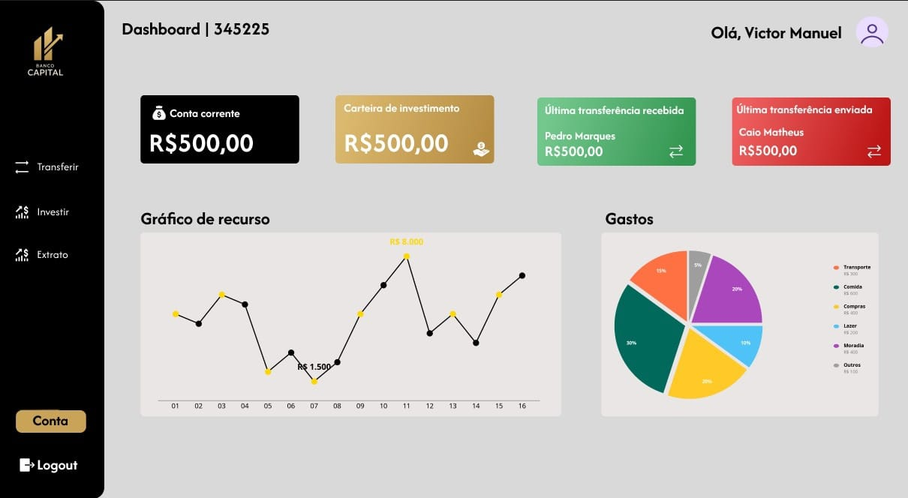

# Banco Capital
# EM DESENVOLVIMENTO
Descrição

<p>O Banco Capital é um sistema bancário desenvolvido para simular operações financeiras essenciais, como abertura de contas, depósitos, saques e consultas de saldo. O projeto visa proporcionar o conhecimento em Python, Rede local, Front-end e Back-end. </p>

utilizando a linguagem   e o framework Custom Tkinter.

# Estrutura do projeto
```python
banco-capital-client/
├── docs/
│   └── TODO.md
├── src/
│   ├── bank_screen_options/
│   │   ├── __init__.py
│   │   ├── bank_menu.py
│   │   └── lear
│   ├── credencial_screen/
│   │   └── server_handler/
│   │       ├── __init__.py
│   │       ├── lear
│   │       ├── server_operations.py
│   │       ├── server_requests.py
│   │       ├── credencial_shell.py
│   │       └── verificar_cpf_inexistente.py
│   ├── __init__.py
│   └── view/
│       ├── __init__.py
│       ├── gerar_grafico_transferencias.py
│       ├── Banco_Capital.py
│       └── client.py
├── README.md
└── requirements.txt


```

# Instalação
Para rodar o projeto você precisa instalar o servidor do Banco Capital em sua máquina ([banco-capital-server](https://github.com/vitao-al/banco-capital-server.git))
# Rodar o projeto
1° Etapa: inicializar o servidor. Navegue até o diretório do servidor e rode:
```python
    python server.py

```
Irá se deparar com esse log caso dê tudo certo.

```bash
    Aguardando conexão...
```
2° Etapa: baixar esse repositório e retirar separar a pasta "banco-capital-client"
3° Etapa: navegar até o diretório que você colocou a pasta "banco-capital-client" e rodar o seguinte comando para abrir a INTERFACE GRÁFICA.
```python
    python Banco_Capital.py

```
Essa é a resposta do servidor ao se conectar com lado do cliente.
```python
Conectado a ('127.0.0.1', 54401)

```
## Telas do Projeto

<h3>Tela de Login</h3>


<h3>Tela de Cadastro</h3>


<h3>Tela de Dashboard</h3>


